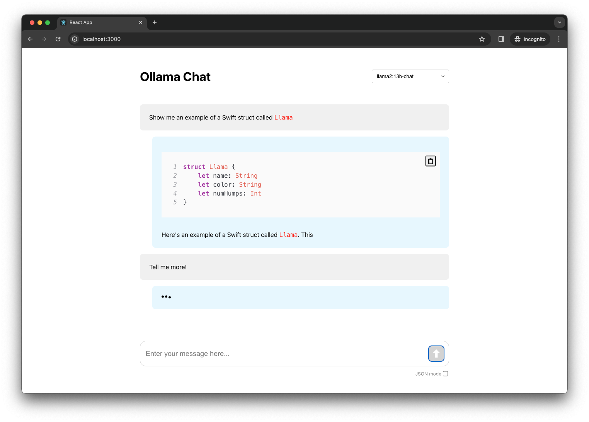

# Ollama Chat

UI to interact with locally-running LLMs from [ollama.ai](https://ollama.ai/). Includes basic code formatting (and eventually lots of other types of formatting!)

This repository is a work in progress.

## Getting started

1. Download and install [Ollama](https://ollama.ai/). Once installed, make sure Ollama is running.
2. Run `npm start` from this repos root.
